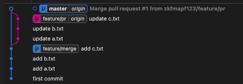
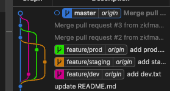
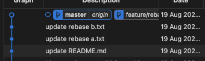
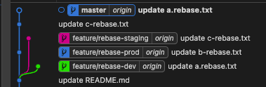

# Git Strategy

## Merge

- 간단
- 새로운 브랜치자체가 master merge 되거나 그 반대가 됨
- 기존 master 브랜치에 pollution이 될 가능성 존재

- \*/dev, prod, staging 브랜치가 있다고 가정할때
- merge 후 master를 fast-forward 하면 위 그림과 같이 나옴

## Rebase

- feature/rebase 에서 작업 후
- master 브랜치에서 rebase 함
- 선형적인 그래프가 나옴

- 기존 그래프가 머지가 되는것이 아닌 Rebase 형태로 붙음
- 좀더 선형적인 그래프가 됨
