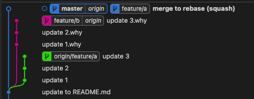

# Git Strategy

## Merge


- 간단
- 새로운 브랜치자체가 master merge 되거나 그 반대가 됨
- 기존 master 브랜치에 pollution이 될 가능성 존재


- \*/dev, prod, staging 브랜치가 있다고 가정할때
- merge 후 master를 fast-forward 하면 위 그림과 같이 나옴

## Rebase


- feature/rebase 에서 작업 후
- master 브랜치에서 rebase 함
- 선형적인 그래프가 나옴


- 기존 그래프가 머지가 되는것이 아닌 Rebase 형태로 붙음
- 좀더 선형적인 그래프가 됨

## Merge vs Rebasing



```
    // branch 작업
    git switch master
    git switch -C feature/a

    // ... 여러가지 commit

    git swtich master
    git switch -C feature/b

    // ... 여러가지 commit

    // rebase 작업
    git rebase feature/b feature/a (feature/b에 feature/a 줄세우기)
    // current branch => feature/a
    // conlictf를 수정하면서 rebase --continue로 작업해야 함

    // master를 rebase로 fast-forward로 수정하기
    git rebase feature/a master
```

## Conclusion

- Rebase 폼 미쳤다이

- 사진을 보면 좀더 이해가 쉬울듯..

## Reference

- Git Extensions (Git Graph) => 무조건 까셈

- Git Rebase Practice Site (https://learngitbranching.js.org/?locale=ko)
